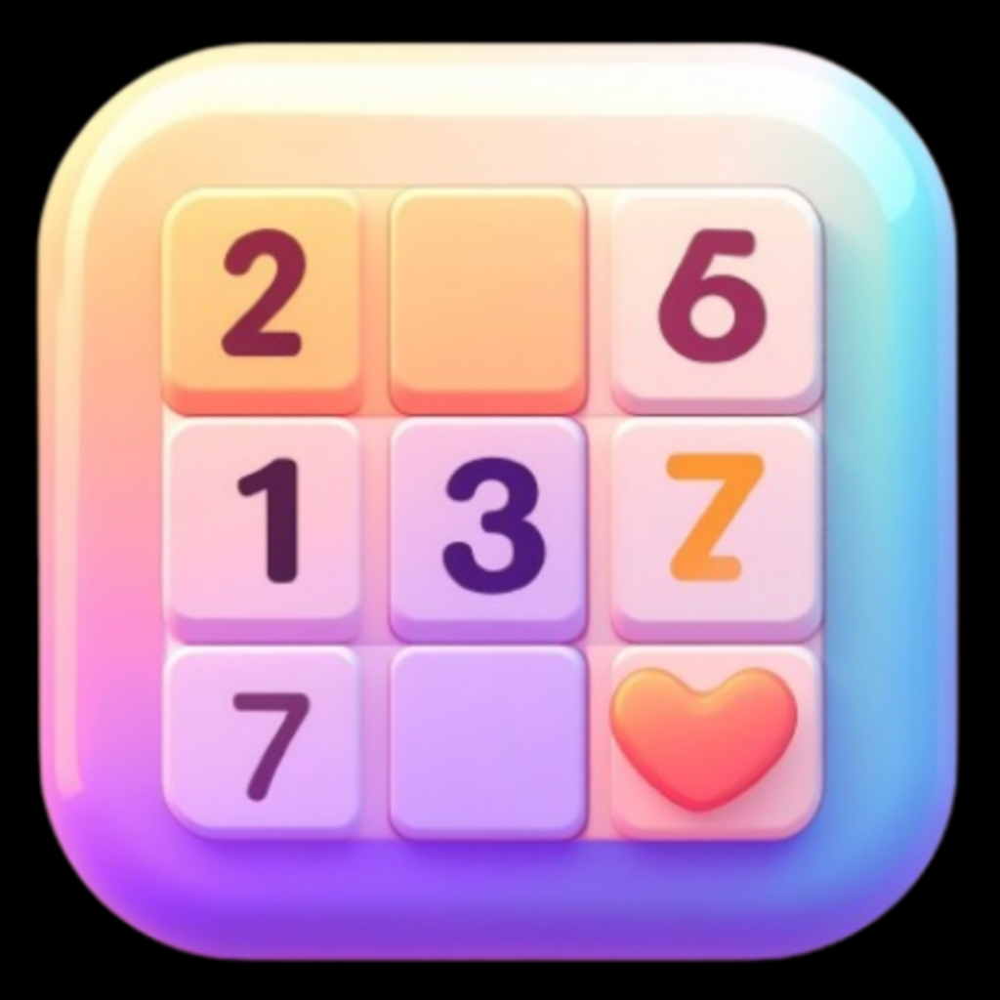

# 🧩 Sudoku — Flutter Cross‑Platform Puzzle App

<p align="center">
  
</p>

<p align="center">
  <b>Beautiful animated Sudoku with rating, leaderboard, and multi‑difficulty play.<br/>Built in Flutter for iOS • Android • Web • Desktop.</b>
</p>

---

## ✨ Features

| 🚀 | Feature | Description |
|----|---------|-------------|
| 🎮 | Game Modes | Easy 4×4 • Medium 6×6 • Hard 9×9 with adaptive timers & mistake caps |
| 🏆 | Rating System | Earn / lose rating: Easy +5 / −5, Medium +20 / −7, Hard +40 / −12 |
| 📊 | Stats & Win % | Aggregated games, wins, win%, average win time |
| 👑 | Leaderboard | Top players podium with medals & win% display |
| 🔐 | Auth | Firebase Auth (Google Sign‑In) (config files excluded from repo) |
| 💾 | Cloud Sync | Firestore user profiles & recent games |
| ✨ | Polished UI | Glassmorphism, animated headers, Lottie loaders, entrance transitions |
| 🧠 | Logic Validation | Mistake tracking & loss on time out or mistake limit |
| 📱 | Multi‑Platform | Runs on Android, iOS, Web, macOS, Windows, Linux |

---

## 🧠 Game Mode Rules

| Mode | Board | Time Limit | Mistake Limit | Rating Δ |
|------|-------|-----------|---------------|----------|
| Easy | 4×4 | 1m 30s | 1 | +5 / −5 |
| Medium | 6×6 | 5m | 4 | +20 / −7 |
| Hard | 9×9 | 15m | 5 | +40 / −12 |

A game is a loss if either the timer expires or the mistake limit is reached.

---

## 🏁 How to Play (Quick Start)
1. Pick a difficulty from Play Now.
2. Tap a cell, then select a number to fill it.
3. Each row, column, and box must contain each number exactly once.
4. Duplicates create mistakes — hitting the limit ends the game.
5. Finish before the timer runs out to win and earn rating.

---

## 📷 Visual Elements
Medals shown in leaderboard:

<p>
  
  
  
</p>

---

## 🔧 Tech Stack
- Flutter & Dart
- Firebase Auth + Firestore
- Provider for lightweight state
- Custom animations (AnimationController, implicit + explicit transitions)
- Lottie for loading overlays

---

## 📦 Project Structure (Key Folders)
```
lib/
  src/
    controllers/        # Game & profile logic
    features/home/      # Home screen widgets & info sheet
    screens/            # Main navigable screens
    models/             # Data models (profile, leaderboard, puzzle)
    services/           # Puzzle generator
assets/
  images/               # App icons & medal graphics
  lottie/               # Loading animations
```

---

## 🛠 Setup & Run
```bash
flutter pub get
flutter run  # pick device / platform
```

### Firebase Configuration (Required)
The following files are intentionally NOT committed:
```
android/app/google-services.json
ios/Runner/GoogleService-Info.plist
```
Add your own Firebase project files for Auth & Firestore to function.

---

## 🔐 Environment & Secrets
Ignored via `.gitignore`:
```
android/key.properties
*.keystore / *.jks
.env*
```
Generate your signing keys separately for release builds.

---

## 🤝 Contributing
1. Fork & clone
2. Create a feature branch: `git checkout -b feat/awesome-thing`
3. Commit changes: `git commit -m "feat: add awesome thing"`
4. Push & open PR

Use conventional commits where possible (feat, fix, chore, refactor, docs, style).

---

## 🧪 Testing
Run default widget test:
```bash
flutter test
```
Add more tests under `test/` for puzzle logic & controllers.

---

## 📈 Roadmap Ideas
- Notes / pencil marks mode 📝
- Daily challenge & streaks 🔥
- Themes / dark variants 🎨
- Hints system with rating penalty 💡
- Offline persistence 💾

---

## 📝 License
Add a license (e.g., MIT) in `LICENSE` if distributing publicly.

---

## 💬 Support
Issues & ideas: open a GitHub Issue. Stars appreciated ⭐

---

<sub>Built with Flutter. Have fun solving! 🧩</sub>
